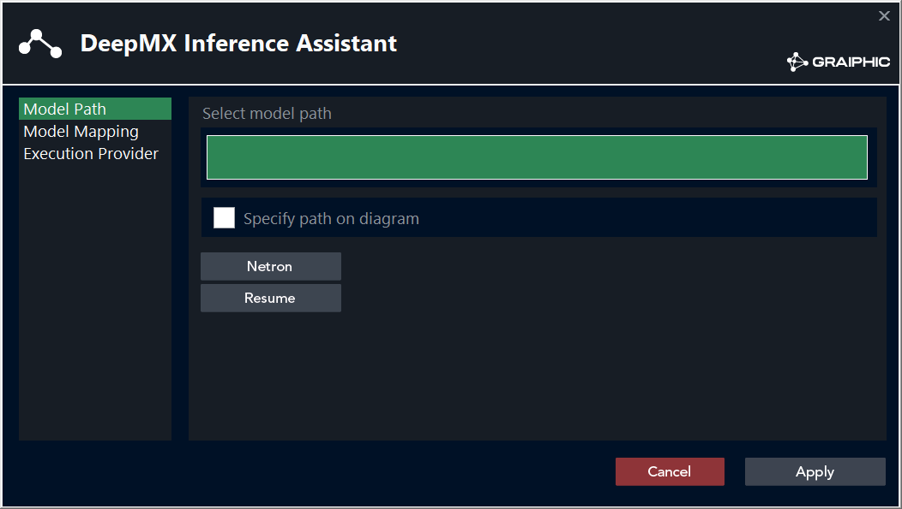
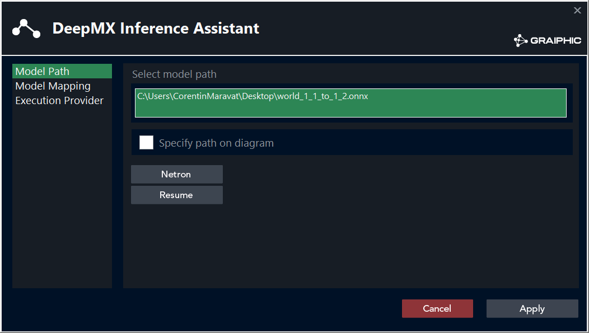
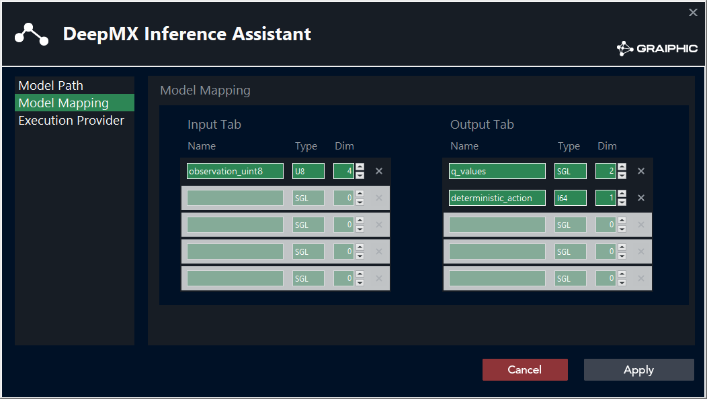
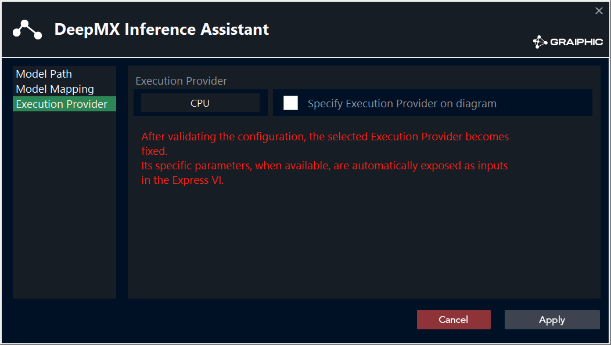
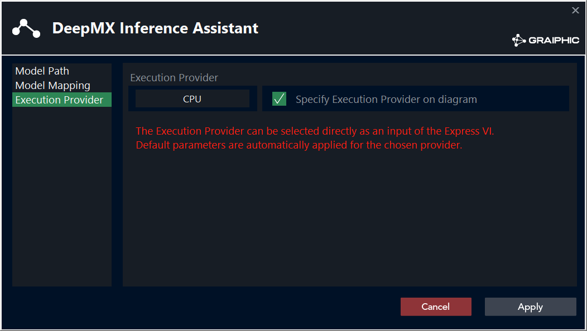
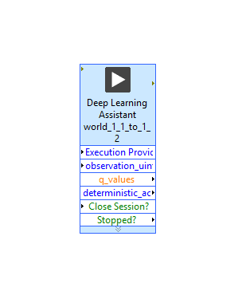
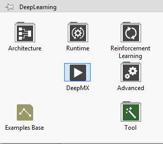

# GraphMX Inference Assistant

> Temporary screenshots use the DeepMX assistant layout until the final GraphMX captures are available.

## Description

GraphMX is an Express VI used to configure an ONNX graph model for inference with ONNX Runtime.
It reads the model interface, prepares the generated VI terminals, and lets the user decide which values stay fixed in the assistant and which values remain inputs on the block diagram.

Type : **Express VI**.

## Model Path

The first page selects the ONNX model file.

- Click the model path field to browse for an `.onnx` file.
- Enable **Specify path on diagram** to expose the model path as an input on the generated VI.
- Use **Netron** to open the model graph and inspect layers, tensors, and connections.
- Use **Resume** to generate a text summary of the model inputs, outputs, names, types, and shapes.

When a model is selected, the assistant can read its inputs and outputs and fill the model mapping automatically.

## Model Mapping

The mapping page defines the public interface of the generated VI.

| Area | Purpose |
| --- | --- |
| Input Tab | Lists model inputs with their name, data type, and dimension count. |
| Output Tab | Lists model outputs with their name, data type, and dimension count. |

If the ONNX model is available, GraphMX fills this table from the model metadata.
If the model is not available yet, the mapping can be prepared manually by typing the expected input and output names, types, and dimensions.

This manual mode is useful when a VI must be prepared before the final model file is present.

## Execution Provider

The execution provider page selects where ONNX Runtime will execute the model.

Available providers include CPU, DirectML, CUDA, TensorRT, OpenVINO, and ONNX/default runtime execution.

### Fixed provider

When **Specify Execution Provider on diagram** is disabled, the selected provider is fixed in the assistant configuration.
The generated VI does not expose an execution provider input.

If the fixed provider has dedicated parameters, GraphMX exposes the matching parameter cluster on the generated VI.
For example, CUDA, TensorRT, and OpenVINO can expose different parameter clusters because their settings are not identical.

### Provider on diagram

When **Specify Execution Provider on diagram** is enabled, the generated VI exposes an execution provider input.
The provider can then be selected directly from the block diagram, and default parameters are applied for the chosen provider.

## Generated VI

After validation, GraphMX drops a configured inference VI on the block diagram.

Typical terminals are:

- Optional **model path** input, if the path is specified on diagram.
- Optional **Execution Provider** input, if the provider is specified on diagram.
- Provider-specific parameter cluster when a fixed provider requires parameters.
- One input terminal for each mapped model input.
- One output terminal for each mapped model output.
- **Close Session?** to close the ONNX Runtime session when the VI is done.
- **Stopped?** to propagate the stop state.

The generated VI is meant to be wired directly into the LabVIEW diagram without rebuilding the ONNX Runtime session setup by hand.

## Typical Workflow

1. Drop **GraphMX** from the Accelerator palette.
2. Select an ONNX model file.
3. Inspect the model with **Netron** or **Resume** if needed.
4. Review or edit the input and output mapping.
5. Choose the execution provider strategy.
6. Apply the configuration and wire the generated VI.
