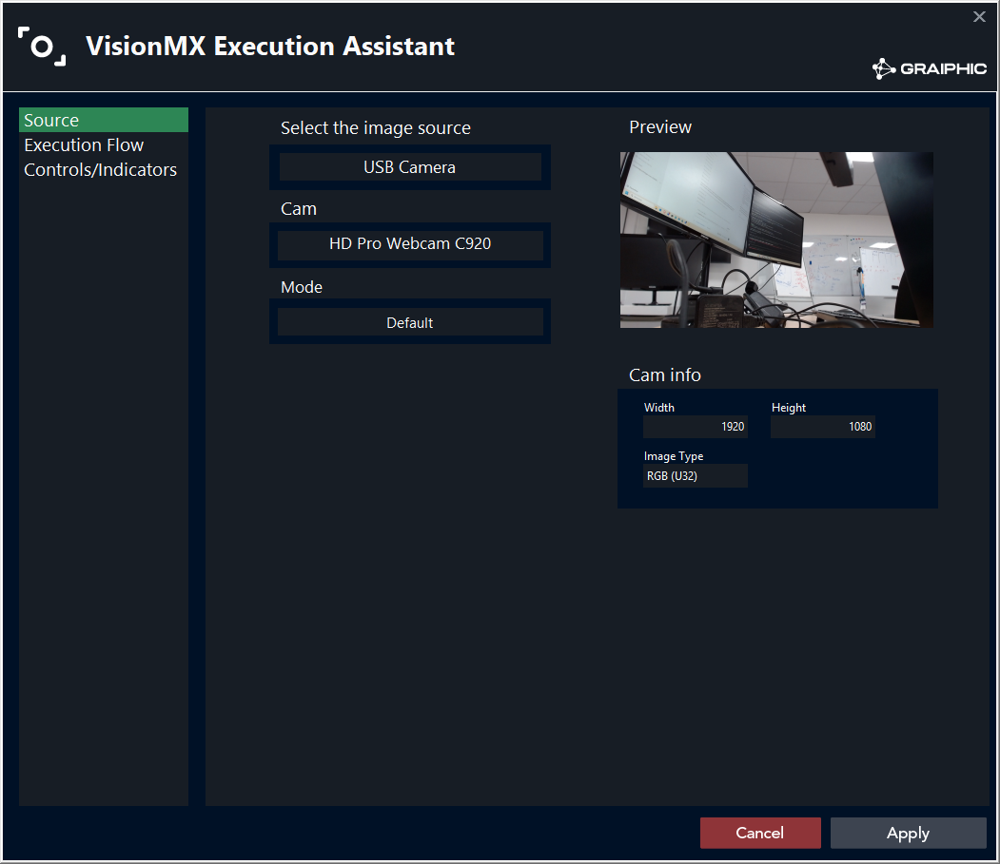
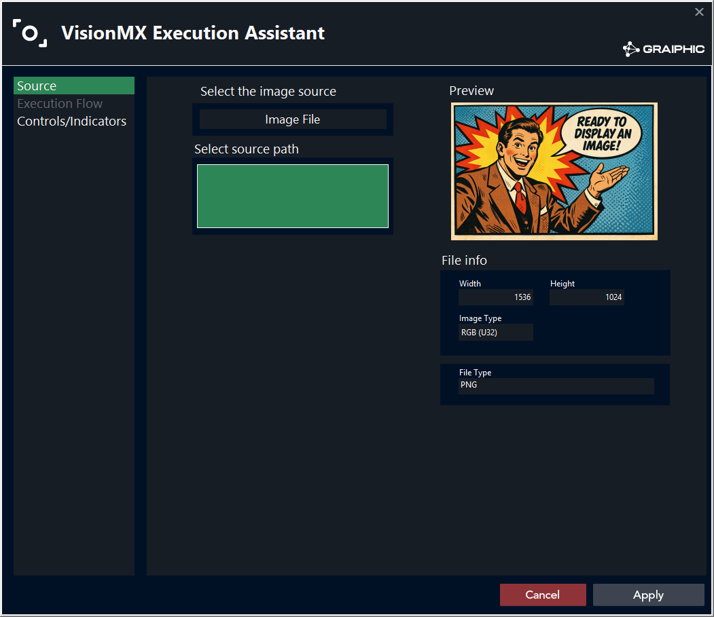
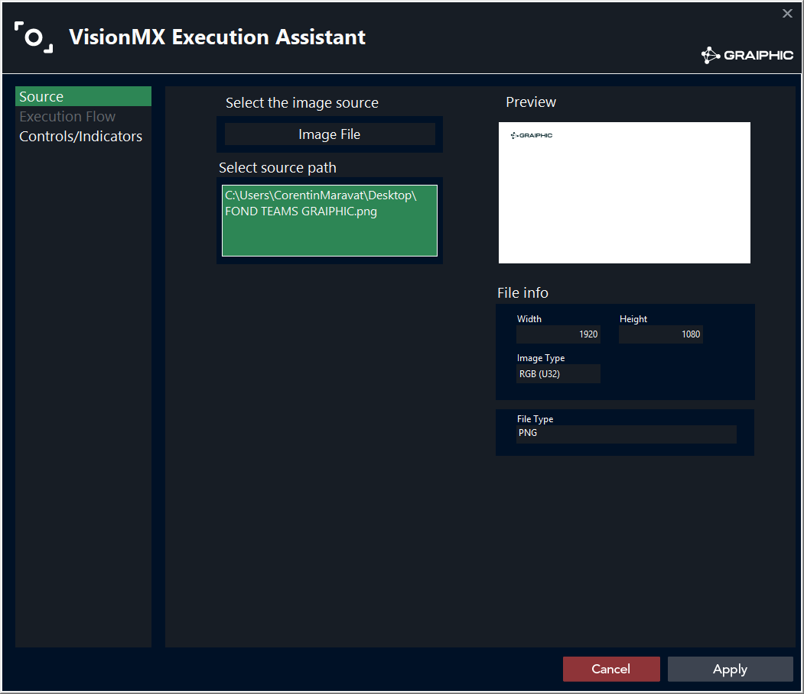
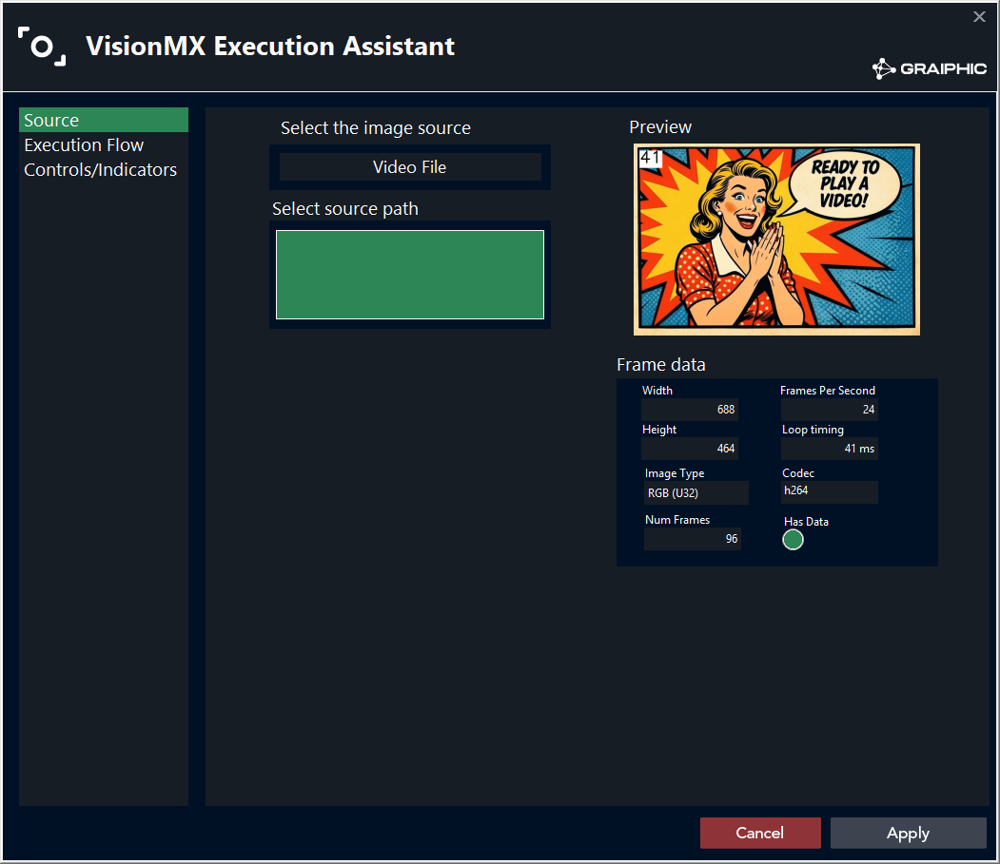
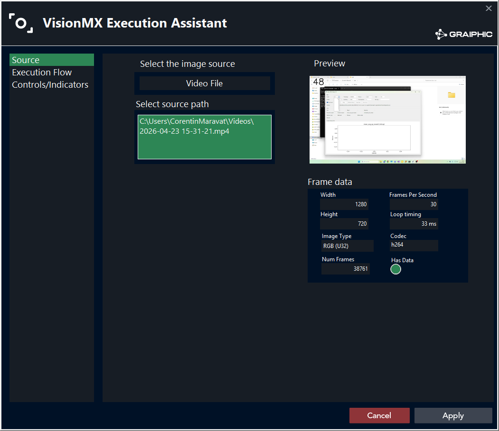
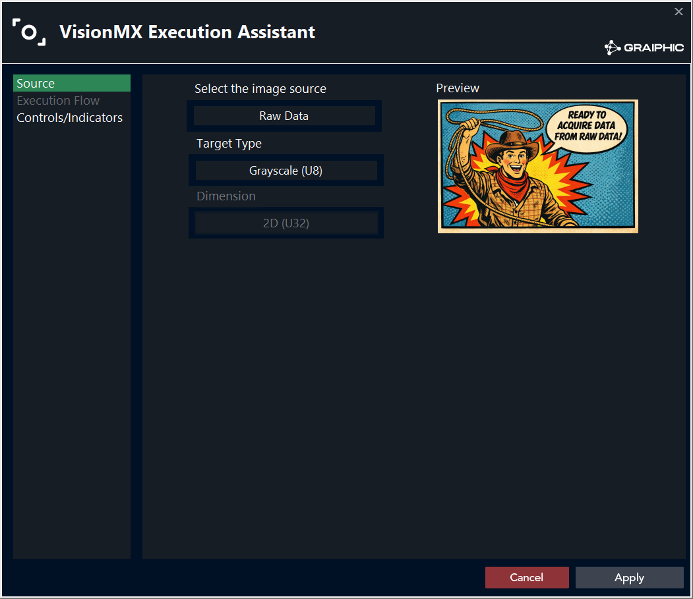
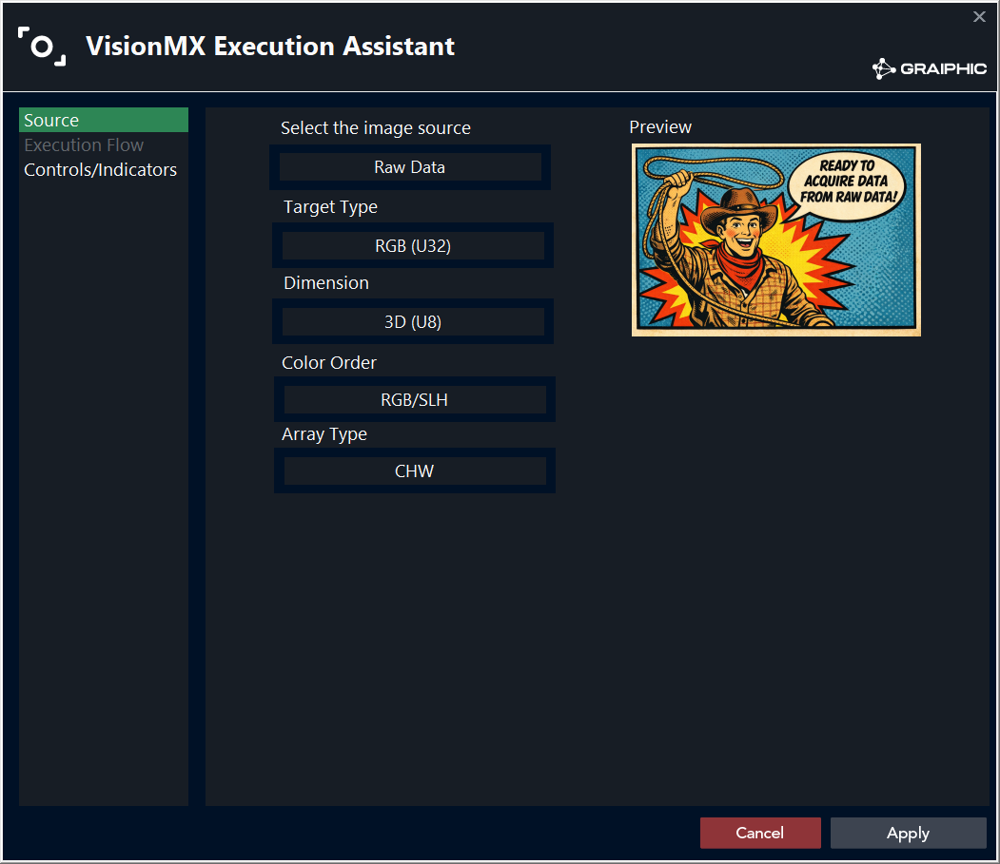
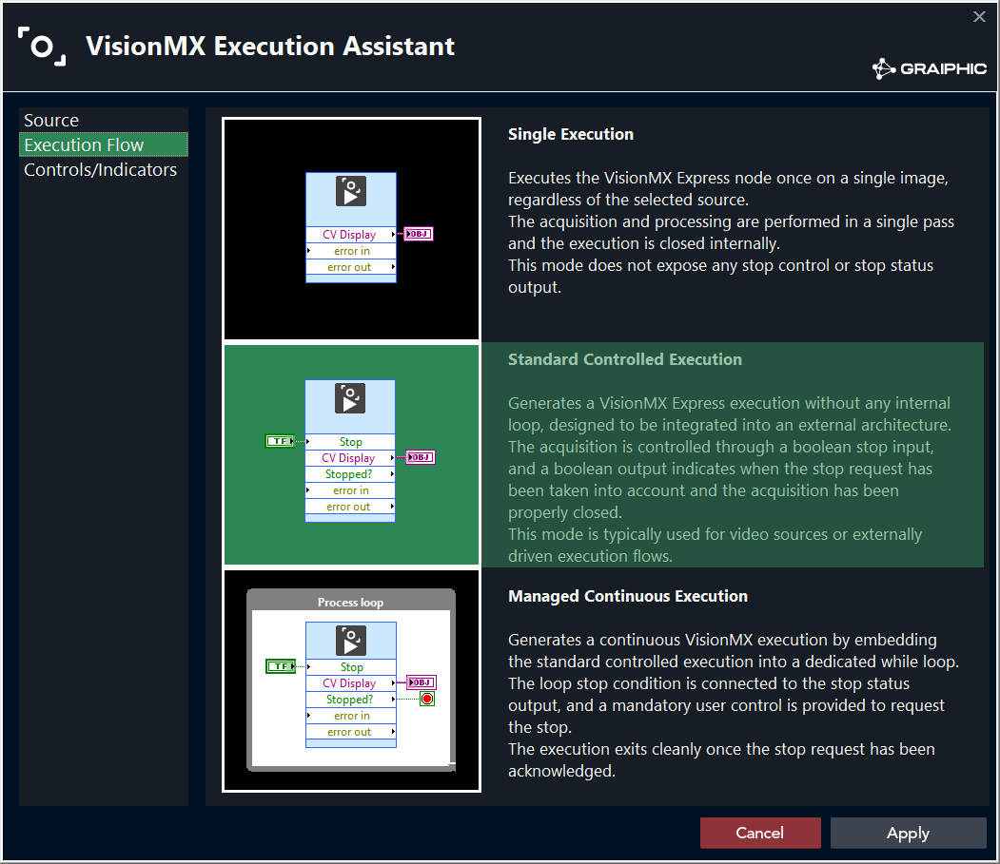
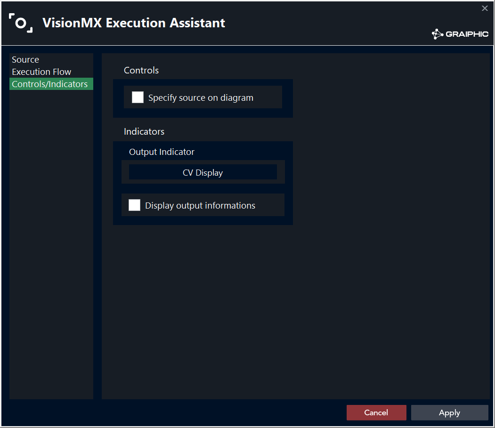
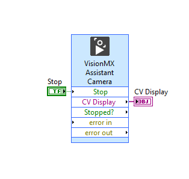

# VisionMX Execution Assistant

## Description

VisionMX is an Express VI used to configure an image acquisition or image input source for the LabVIEW Computer Vision Toolkit.
It prepares a ready-to-wire VI for camera frames, image files, video files, or raw image arrays.

Type : **Express VI**.

## Source

The source page selects where the image data comes from.

### USB Camera

USB Camera mode detects the cameras currently connected to the computer.
After selecting a camera, VisionMX lists the acquisition modes supported by that camera.

The preview shows the live camera image, and the camera information panel displays the selected frame width, height, and image type.

### Image File

Image File mode reads one image from disk.
Click the source path field to browse for an image file.

Before a file is selected, the preview displays a placeholder image.

After selection, VisionMX displays the selected image and reports the file information, including width, height, image type, and file type.

### Video File

Video File mode reads frames from a video file.
Click the source path field to browse for a video.

Before a file is selected, the preview displays a placeholder video.

After selection, VisionMX plays the video preview in a loop and displays the current frame number.

The frame data panel reports the width, height, image type, frame rate, loop timing, codec, frame count, and data availability.

### Raw Data

Raw Data mode receives image data directly from LabVIEW arrays.
No file is selected, so the preview keeps the raw-data illustration.

The target type defines how the incoming array must be interpreted:

- Grayscale U8.
- Grayscale U16.
- RGB U32.
- HSL U32.

For U32 image types, the dimension selector can expose either a 2D U32 layout or a 3D U8 layout.

When the 3D layout is selected, VisionMX also exposes:

- **Color Order**, for example RGB, BGR, RBG, BRG, GBR, or GRB.
- **Array Type**, to select channel-first or channel-last layout, such as CHW or HWC.

## Execution Flow

Execution Flow is available for live or sequential sources: USB Camera and Video File.
It is disabled for Image File and Raw Data because those sources do not need an acquisition loop.

### Single Execution

Single Execution reads one image and closes the acquisition internally.
This mode does not expose a stop control or stop status output.

### Standard Controlled Execution

Standard Controlled Execution prepares a VisionMX node that can read multiple frames, but it does not create the loop.
Use this mode when the acquisition is controlled by an external LabVIEW loop.

The generated VI exposes stop wiring so the caller decides when the acquisition must close.

### Managed Continuous Execution

Managed Continuous Execution creates the VisionMX node with a dedicated while loop around it.
The loop stop condition is connected to the generated stop status, and a user stop control is provided.

Use this mode mainly when placing the VI for the first time.
Reapplying this configuration repeatedly can create nested loops around an existing node, because detecting and rewriting an existing loop reliably is difficult.

## Controls/Indicators

The Controls/Indicators page chooses which terminals are exposed on the generated VI.

### Controls

Enable **Specify source on diagram** when the selected source must remain configurable from the block diagram.
In that case, the generated VI exposes a source input instead of keeping the source fully fixed in the assistant configuration.

### Indicators

The **Output Indicator** selector chooses how the acquired image is displayed or returned.
It can use the Computer Vision Toolkit **CV Display** or a standard LabVIEW Picture output.

Enable **Display output informations** when the caller needs metadata such as size, type, frame data, file data, camera data, or acquisition status.

## Generated VI

After validation, VisionMX drops the configured acquisition VI on the block diagram.

Typical terminals are:

- Optional source input, depending on the selected source and exposed controls.
- Display output, for example **CV Display** when selected as the output indicator.
- Optional source or frame information indicators.
- **Stop** input for standard controlled and managed continuous execution modes.
- **Stopped?** output to report that the acquisition stop request has been acknowledged.
- Error input and error output.

The generated VI is meant to make common vision input setup fast, without rebuilding camera, file, video, or raw-array acquisition logic by hand.

## Typical Workflow

1. Drop **VisionMX** from the Computer Vision palette.
2. Choose the image source: USB Camera, Image File, Video File, or Raw Data.
3. Configure the source details and check the preview.
4. Select the execution flow when the source is a camera or video.
5. Choose which controls and indicators must appear on the generated VI.
6. Apply the configuration and wire the generated node.
