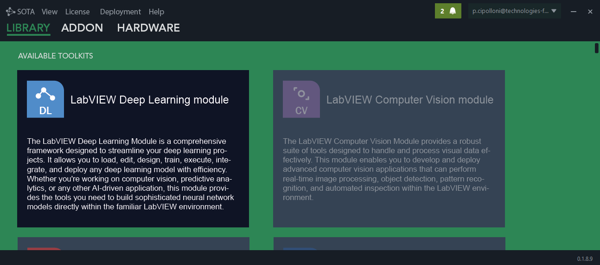
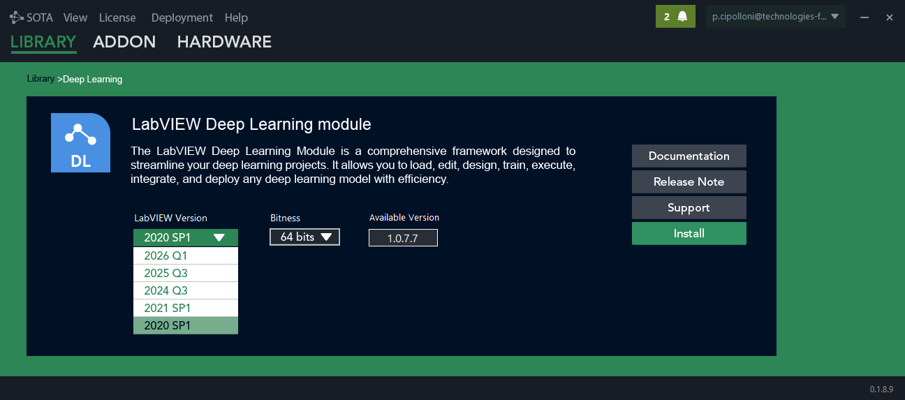
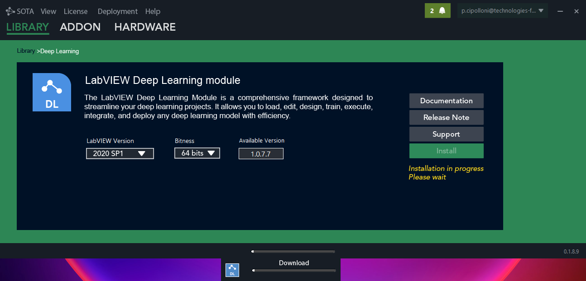
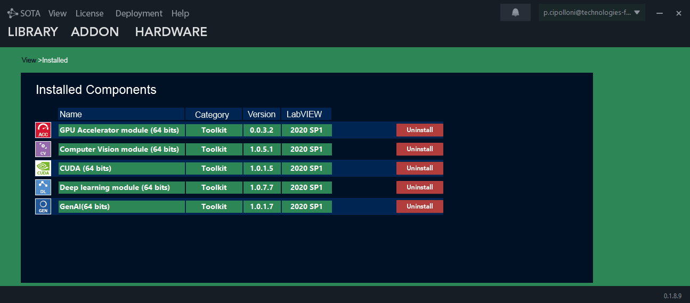
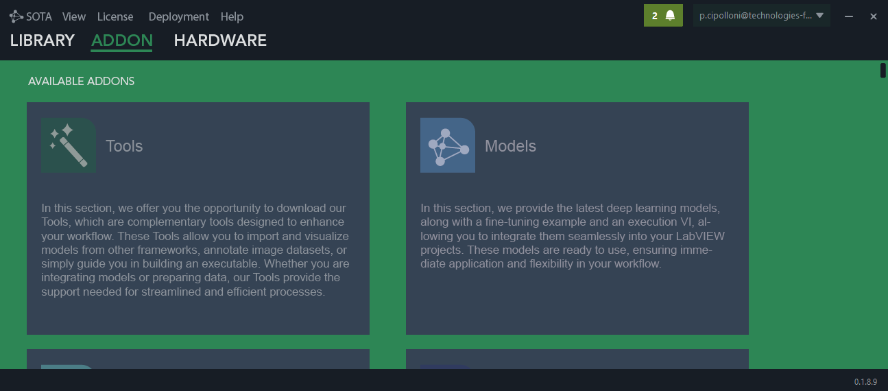
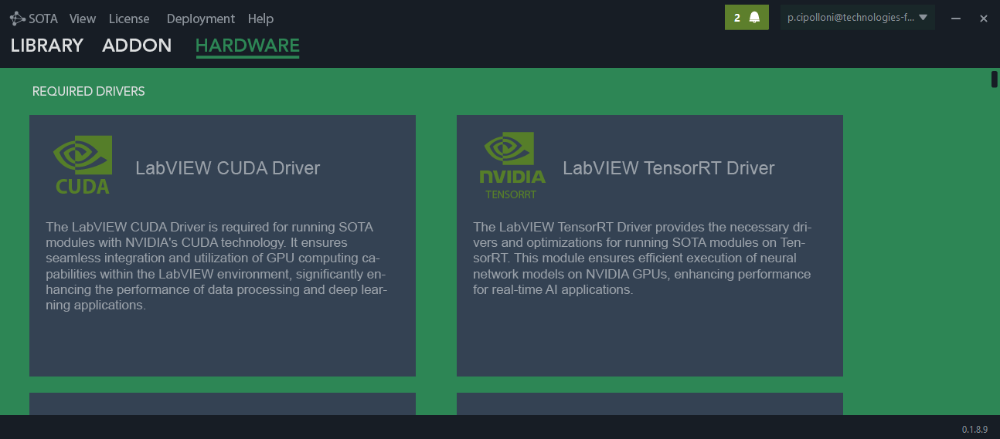
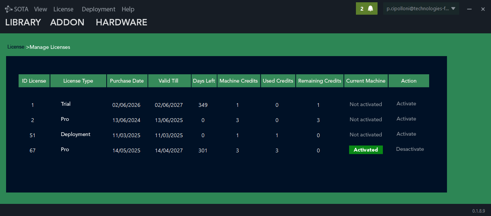
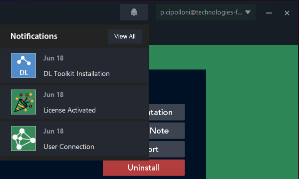

# Understanding SOTA

SOTA is the Graiphic installer and management application for the LabVIEW toolkit ecosystem. It gives users one place to install Graiphic toolkits, add complementary resources, prepare hardware drivers, select compatible LabVIEW targets, and manage licenses linked to the connected account.

In practice, SOTA is the control layer that keeps the Graiphic environment consistent before a user starts building applications in LabVIEW.

## What SOTA Manages

| Area | Purpose |
| --- | --- |
| Toolkits | Install and maintain Graiphic LabVIEW modules such as Deep Learning, Computer Vision, Accelerator, CUDA, and GenAI. |
| Addons | Download complementary tools, ready-to-use models, environment packages, examples, and workflow helpers. |
| Hardware | Install required drivers or runtime components, such as CUDA or TensorRT support, for advanced execution scenarios. |
| Extensions | Add model, environment, or hardware packages that extend a toolkit for a specific domain or deployment target. |
| LabVIEW targets | Select the LabVIEW version and bitness that must receive the selected component. |
| Licenses | Activate, deactivate, and monitor licenses associated with the connected user account and current machine. |
| Notifications | Track user actions such as installation, connection, and license activation events. |

## Main Application Views

SOTA is organized around a simple navigation model. The main tabs separate the installation catalog from account, deployment, and support features, while the second-level navigation separates toolkits, addons, and hardware components.

  

<em>The Library view lists the available Graiphic toolkits and gives users a short functional description before installation.</em>

## Toolkits

Toolkits are the primary Graiphic LabVIEW modules installed through SOTA.

| Toolkit | Role in the Graiphic ecosystem |
| --- | --- |
| LabVIEW Deep Learning Toolkit | Covers model construction, graph definition, runtime execution, training metrics, weight management, and advanced helpers for ONNX-backed neural workflows. |
| LabVIEW Computer Vision Toolkit | Provides image processing functions, manipulation utilities, display helpers, session management, and video writer tools for LabVIEW vision pipelines. |
| LabVIEW Accelerator Toolkit | Connects LabVIEW applications to ONNX Runtime execution providers such as CUDA, TensorRT, OpenVINO, and OneDNN. |
| LabVIEW CUDA Toolkit | Gives direct access to GPU-accelerated primitives for arrays, numeric operations, transforms, tensor memory control, and CuBLAS-backed routines. |
| GenAI Toolkit | Groups LLM workflows, cloud and local model runtimes, GGUF execution, text-to-speech, and audio processing utilities for LabVIEW. |

When a user opens a toolkit page, SOTA displays the component description, documentation links, release notes, support access, the available version, and installation controls.

  

<em>The LabVIEW version selector ensures that the installed package matches the user's LabVIEW target.</em>

## Installation Flow

Before installing a component, users select the LabVIEW version and bitness. SOTA then downloads and installs the correct package for that target. The interface displays the current action so the user can follow the installation state.

  

<em>During installation, SOTA shows the component being installed and the current download or installation step.</em>

Installed components are available from the installed view. This screen shows the component name, category, installed version, LabVIEW target, and uninstall action.

  

<em>The installed view gives a quick audit of the Graiphic modules already present on the workstation.</em>

## Addons

Addons extend toolkit workflows without necessarily being full LabVIEW toolkits. They can include tools, model packages, environment packages, examples, or utilities that support a more specific workflow.

For example, model addons can provide ready-to-use deep learning models, fine-tuning examples, and execution VIs that can be integrated directly into LabVIEW projects. Environment addons can prepare the dependencies or resources required by a specialized domain. Tool addons can help users import and visualize models, annotate image datasets, prepare data, or build executable workflows.

  

<em>Addons give users domain-specific resources that complement the installed toolkits.</em>

## Hardware And Runtime Extensions

Some SOTA installations are hardware or runtime extensions. These components prepare the workstation for advanced execution paths, such as GPU acceleration or optimized neural network inference.

Hardware entries can install required drivers and support components such as CUDA or TensorRT. These installations are especially important when a toolkit must use GPU computing, real-time inference, or an ONNX Runtime execution provider.

  

<em>Hardware components prepare the machine for advanced Graiphic workflows such as CUDA or TensorRT execution.</em>

## License Management

SOTA connects installation and usage rights to the signed-in user account. From the license management view, users can see available licenses, purchase dates, validity, remaining days, machine credits, used credits, remaining credits, and the current activation state.

Users can activate a license on the current machine or deactivate it when they need to move the license to another workstation.

  

<em>The license table makes account-linked activation visible and gives users direct control over machine activation.</em>

## Notifications

SOTA can generate notifications after user actions. Typical events include toolkit installation, license activation, and user connection. This gives users a quick activity history without leaving the application.

  

<em>The notification center records important actions and helps users confirm that SOTA responded to their latest operation.</em>

## Typical Workflow

1. Sign in with a Graiphic account.
2. Open the Library, Addon, or Hardware section depending on the required component.
3. Read the component description, documentation, release notes, and support information.
4. Select the compatible LabVIEW version and bitness.
5. Install the component.
6. Activate the required license from the License section.
7. Use notifications and the installed component view to confirm the result.

## Summary

SOTA centralizes the operational side of the Graiphic LabVIEW ecosystem. It installs the right toolkit for the right LabVIEW target, adds optional resources for advanced workflows, prepares hardware runtimes, manages account-based licenses, and records important user actions through notifications.

For users, SOTA is the starting point before using Graiphic modules in LabVIEW. For administrators, it is the place to verify installed versions, license activation, and machine readiness.
